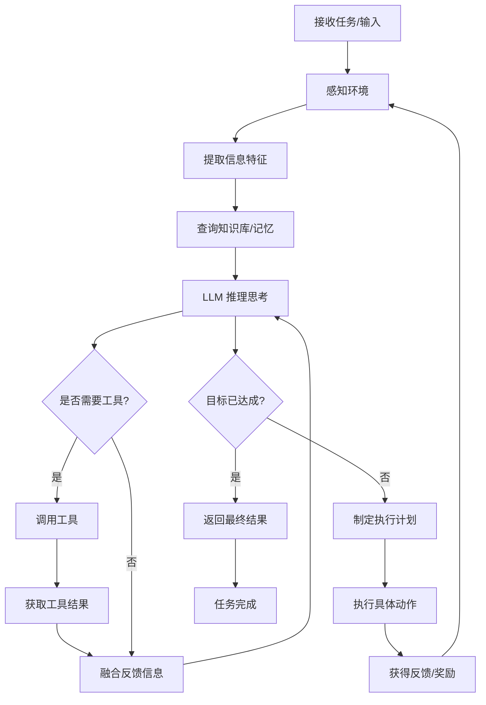

# AI Agent 知识地图

> 全面、系统的 AI Agent 领域知识架构，帮助快速建立认知框架

## 🌍 核心层级结构

```
┌─────────────────────────────────────────────────────────┐
│              AI Agent 知识体系                           │
├─────────────────────────────────────────────────────────┤
│
├─ 📌 第一层：基础认知（What is Agent?）
│  ├─ 定义与特征
│  ├─ 历史演进
│  ├─ 分类体系
│  └─ 核心价值
│
├─ 🏗️  第二层：架构设计（How to build Agent?）
│  ├─ 感知模块（Perception）
│  ├─ 思考模块（Cognition）
│  ├─ 决策模块（Decision）
│  └─ 执行模块（Action）
│
├─ 🛠️  第三层：技术栈（With what tools?）
│  ├─ LLM 基础
│  ├─ 检索增强（RAG）
│  ├─ 工具系统
│  ├─ 记忆管理
│  └─ 推理机制
│
├─ 📦 第四层：框架工具（Which frameworks?）
│  ├─ LangChain
│  ├─ AutoGPT
│  ├─ CrewAI
│  ├─ Semantic Kernel
│  └─ 其他框架
│
├─ 🎯 第五层：应用实践（What to build?）
│  ├─ 单 Agent 应用
│  ├─ 多 Agent 系统
│  ├─ 领域特定应用
│  └─ 企业级方案
│
└─ 🚀 第六层：前沿发展（Future directions?）
   ├─ 研究热点
   ├─ 技术趋势
   ├─ 创新方向
   └─ 挑战与机遇
```

---

## 📌 第一层：基础认知

### 1.1 什么是 AI Agent？

**定义**
- 一个自主的、具有感知-决策-执行能力的智能体
- 能够感知环境、理解任务、制定计划并执行行动
- 具有一定的学习能力，可根据反馈优化行为

**核心特征**
- ✅ **自主性**：独立制定和执行决策
- ✅ **响应性**：对环境变化做出及时反应
- ✅ **主动性**：主动采取行动达成目标
- ✅ **社交能力**：与其他 Agent 和系统交互

**与传统程序的区别**

| 维度 | 传统程序 | AI Agent |
|------|--------|---------|
| 控制方式 | 流程驱动 | 目标驱动 |
| 决策方式 | 预定义规则 | 动态推理 |
| 环境交互 | 被动响应 | 主动探索 |
| 适应能力 | 固定逻辑 | 学习优化 |

### 1.2 发展演进历程

```
1956-1970s: 符号 AI 时代
    ↓
1980s-1990s: 专家系统
    ↓
2000s: 多 Agent 系统
    ↓
2010s: 深度学习 Agent
    ↓
2020-2022: LLM 预训练时代
    ↓
2023-现在: LLM 驱动的通用 Agent 时代
    ↓
未来: 具身智能、多模态 Agent
```

### 1.3 Agent 的分类体系

**按能力维度**
1. **反应式 Agent（Reactive）**
   - 直接对感知做出反应
   - 无记忆、无计划
   - 例：规则引擎、简单爬虫

2. **延迟式 Agent（Deliberative）**
   - 内部表示环境模型
   - 制定计划后执行
   - 例：路径规划、任务分解

3. **混合式 Agent（Hybrid）**
   - 结合反应和延迟
   - 既快速响应又能制定计划
   - 例：现代 LLM Agent

**按复杂度**
- **简单 Agent**：单一目标、简单决策
- **复杂 Agent**：多目标、动态规划
- **多 Agent 系统**：多个 Agent 协作

**按应用域**
- **对话 Agent**：ChatBot、客服
- **任务 Agent**：自动化任务执行
- **推荐 Agent**：个性化推荐
- **决策 Agent**：数据分析、策略制定

### 1.4 当前阶段的 Agent 浪潮

**LLM 驱动的新 Agent 范式**
- 利用大语言模型作为"大脑"
- 通过 Prompt 进行任务指示
- 通过工具调用扩展能力
- 通过记忆管理保持对话上下文

**核心优势**
- 🎯 不需要大量人工规则编写
- 🧠 更强的理解和推理能力
- 🔧 灵活的能力扩展机制
- 🌍 跨域迁移能力强

---

## 🏗️ 第二层：架构设计

### 2.1 通用 Agent 架构

```
┌─────────────────────────────────────────┐
│          环境（Environment）            │
└─────────────────────────────────────────┘
              ↑↓                ↑↓
    ┌─────────┴─────────┐  ┌────┴─────────┐
    │   Agent 感知      │  │  Agent 执行  │
    │ - 环境观察 (obs)  │  │ - 执行动作   │
    │ - 信息处理        │  │ - 反馈获取   │
    └──────────┬────────┘  └────┬─────────┘
               │                │
               ↓                ↑
    ┌─────────────────────────────────────┐
    │     Agent 核心控制循环               │
    ├─────────────────────────────────────┤
    │  1. Perception (感知)               │
    │  2. Cognition (思考/推理)           │
    │  3. Decision (决策)                 │
    │  4. Planning (规划)                 │
    │  5. Action (执行)                   │
    └─────────────────────────────────────┘
             ↑            ↓
    ┌────────────────────────────────────┐
    │  知识库 / 记忆 / 工具库             │
    └────────────────────────────────────┘
```

### 2.2 Agent 的工作流程



### 2.3 关键模块详解

**1. 感知模块（Perception）**
- 从环境获取多模态信息（文本、图像、音频等）
- 进行信息预处理和特征提取
- 维护对环境的理解表示

**2. 记忆模块（Memory）**
- 短期记忆：当前对话/任务上下文
- 长期记忆：知识库、学习经验
- 工作记忆：中间推理结果

**3. 推理模块（Reasoning）**
- 使用 LLM 进行自然语言推理
- 逻辑推导和因果推理
- 链式思考（Chain-of-Thought）

**4. 决策模块（Decision）**
- 评估多个行动选项
- 选择最优行动
- 权衡不同目标

**5. 行动模块（Action）**
- 调用工具/API 执行任务
- 与环境交互
- 获取反馈信息

---

## 🛠️ 第三层：技术栈

### 3.1 LLM（大语言模型）

**核心概念**
- 基于 Transformer 架构的深度学习模型
- 通过预训练学习语言模式
- 具有强大的理解和生成能力

**主流模型**
- OpenAI：GPT-4、GPT-3.5
- Anthropic：Claude
- Google：Gemini、Palm
- Meta：Llama
- 中国：Qwen、ChatGLM、Ernie

**API 调用与 Token 管理**
- 理解 Token 计费机制
- 优化 Prompt 长度降低成本
- 处理模型的上下文限制

### 3.2 检索增强生成（RAG）

**问题场景**
- LLM 知识库有时间限制
- 需要引入外部最新信息
- 减少 Hallucination（幻觉）

**RAG 流程**
```
1. 文档分块 → 2. 向量化 → 3. 存储
                           ↓
用户查询 → 向量化 → 相似度检索 → 获取相关文档
   ↓
组织 Prompt（包含检索结果）→ LLM 生成答案
```

**关键技术**
- 向量数据库：Pinecone、Weaviate、Milvus
- 向量化模型：OpenAI Embedding、Sentence Transformers
- 检索算法：稠密检索、稀疏检索、混合检索

### 3.3 工具调用（Tool Calling）

**概念**
- Agent 通过调用外部工具扩展能力
- LLM 理解工具功能并自主调用

**常见工具类型**
- API 接口：Web API、数据库查询
- 代码执行：Python 解释器、SQL 查询
- 搜索：Google、Wiki、文件搜索
- 计算：计算器、数据分析
- 生成：图像生成、代码生成

**Function Calling 机制**
```json
{
  "type": "function",
  "function": {
    "name": "tool_name",
    "description": "工具描述",
    "parameters": {
      "type": "object",
      "properties": {
        "param1": {"type": "string"}
      }
    }
  }
}
```

### 3.4 Prompt 工程

**关键技术**
- **角色扮演**：指定 Agent 身份和职责
- **任务分解**：使用 CoT（Chain-of-Thought）
- **少样本学习**：提供示例指导模型
- **指令模板**：结构化的 Prompt 格式

**最佳实践**
- 清晰的指令和期望输出格式
- 提供相关上下文信息
- 使用分步骤的思考过程
- 定义明确的评估标准

### 3.5 其他关键技术

- **长期规划**：任务分解与子目标设定
- **反思与调整**：自我评估与行为修正
- **人在回路（HiL）**：人类参与决策
- **多模态融合**：整合文本、图像、音频

---

## 📦 第四层：框架工具

### 4.1 主流 Agent 框架对比

| 框架 | 特点 | 适用场景 | 学习曲线 |
|------|------|--------|--------|
| **LangChain** | 功能全面、生态丰富 | 通用 Agent 开发 | 中等 |
| **AutoGPT** | 自主规划、递归分解 | 复杂任务自动化 | 高 |
| **CrewAI** | 多 Agent 协作 | 团队协作场景 | 中 |
| **Semantic Kernel** | 微软生态整合 | 企业应用 | 中 |
| **Camel** | 多 Agent 通信 | 智能体交互研究 | 高 |

### 4.2 LangChain（最广泛采用）

**核心组件**
- LLM Wrapper：模型接口封装
- Chains：任务执行链
- Agents：自主决策系统
- Memory：状态管理
- Tools：能力扩展
- Retrievers：检索系统

**优势**
- ✅ 最完整的生态
- ✅ 丰富的集成
- ✅ 活跃的社区
- ✅ 文档详细

### 4.3 其他框架亮点

**AutoGPT**
- 递归任务分解
- 自主目标设定与执行
- 适合复杂自动化

**CrewAI**
- 多 Agent 框架
- 角色和任务管理
- 适合协作场景

**Semantic Kernel（Microsoft）**
- 与 Azure 生态整合
- 企业级功能
- 插件架构

---

## 🎯 第五层：应用实践

### 5.1 单 Agent 应用场景

1. **对话助手**
   - 客服机器人
   - 个人助理
   - 教育辅导

2. **内容生成**
   - 文章写作
   - 代码生成
   - 设计创意

3. **任务自动化**
   - 数据分析
   - 邮件处理
   - 日程管理

4. **决策支持**
   - 投资分析
   - 医疗诊断
   - 法律咨询

### 5.2 多 Agent 系统

**协作模式**
- **串联**：Agent A 的输出是 Agent B 的输入
- **并联**：多个 Agent 独立工作，结果汇总
- **层级**：主 Agent 协调多个子 Agent
- **竞争**：多个 Agent 互相评审优化

**应用场景**
- 复杂项目管理
- 集团决策制定
- 学术研究协作
- 创意头脑风暴

### 5.3 领域特定应用

**金融领域**
- 量化交易 Agent
- 风险评估
- 投资建议

**医疗领域**
- 诊断辅助
- 用药指导
- 患者管理

**教育领域**
- 个性化教学
- 作业批改
- 学习规划

**制造业**
- 生产调度
- 质量检测
- 故障诊断

---

## 🚀 第六层：前沿发展

### 6.1 当前研究热点

**具身智能（Embodied AI）**
- Agent 控制机器人
- 物理世界交互
- 感官反馈学习

**多模态 Agent**
- 整合视觉、语言、听觉
- 统一理解多种信息
- 更类人的智能表现

**可解释性（Interpretability）**
- 理解 Agent 决策过程
- 提高系统信任度
- 便于调试与改进

**自适应学习**
- Agent 从交互中学习
- 个性化行为调整
- 持续改进能力

### 6.2 技术趋势

1. **模型规模与效率**
   - 小模型的崛起
   - 参数高效微调
   - 推理优化

2. **开源与民主化**
   - 本地模型可部署
   - 框架简化与优化
   - 成本降低

3. **安全与对齐**
   - AI 安全性研究
   - 价值对齐
   - 可控的 Agent 行为

4. **工程化实践**
   - Agent 工程成熟化
   - 标准化接口
   - DevOps 工具链

### 6.3 关键挑战

- **可靠性**：减少错误决策
- **可解释性**：理解 Agent 推理
- **隐私保护**：数据安全
- **资源消耗**：计算效率
- **伦理问题**：价值对齐

---

## 🔗 知识地图导航

```
快速上手
├─ 阅读本文档（知识地图）
├─ 学习 concepts.md（核心概念深化）
├─ 查看 AGENT.md（架构与代码）
└─ 开始 daily/01.md（第一天学习）

深度学习
├─ 理论基础
│  ├─ Agent 论文与综述
│  ├─ LLM 工作原理
│  └─ 多 Agent 系统
│
├─ 框架掌握
│  ├─ LangChain 官方文档
│  ├─ CrewAI 框架学习
│  └─ 其他框架探索
│
├─ 实战应用
│  ├─ 构建简单 Agent
│  ├─ 开发完整应用
│  └─ 优化与调试
│
└─ 前沿追踪
   ├─ 论文阅读
   ├─ 开源项目研究
   └─ 技术分享学习
```

---

## 📚 扩展阅读推荐

**经典论文**
- "Rational Agents" - Russell & Norvig
- "Autonomous Agents" - Ferber
- "Multi-agent Systems" - Weiss
- "Chain-of-Thought Prompting" - Wei et al.

**实战书籍**
- "Building AI Agents" 系列
- "LLM Application Development" 指南
- Agent 框架官方教程

**在线资源**
- Hugging Face 教程
- Coursera AI 课程
- Agent 社区论坛

---

*知识地图更新时间：2026-06-15*
